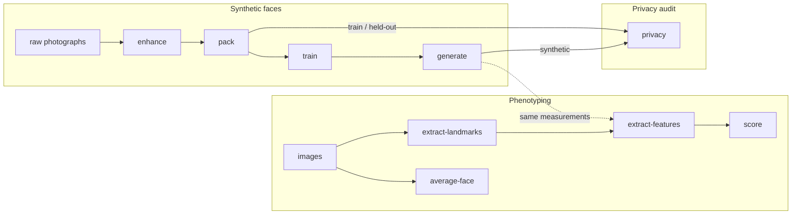
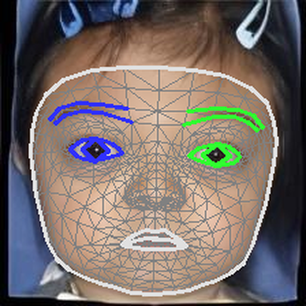
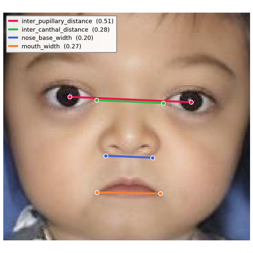
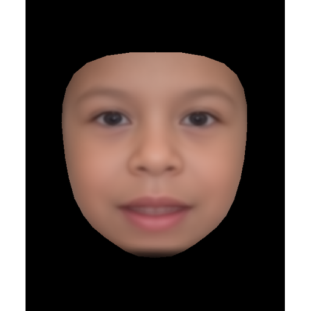
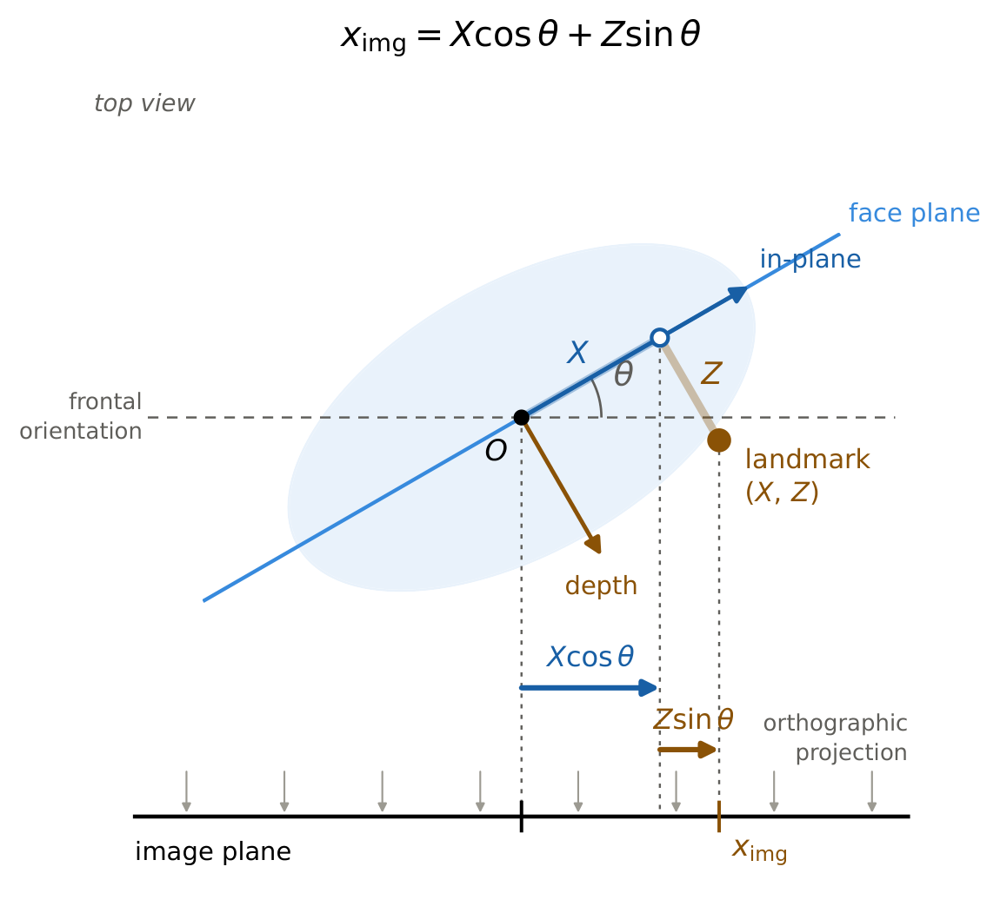
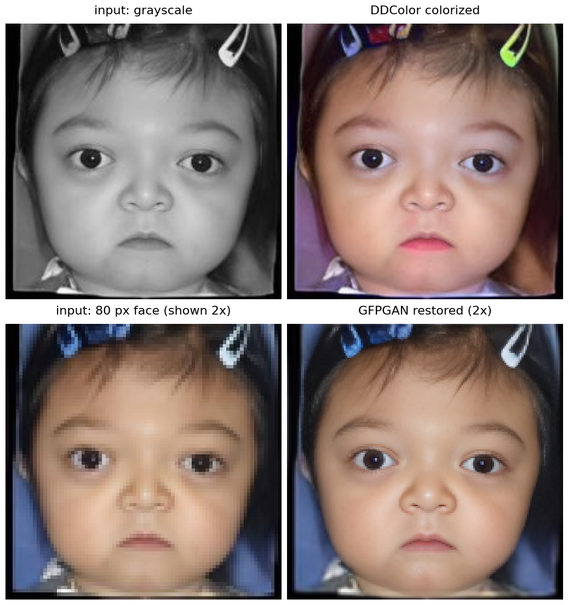
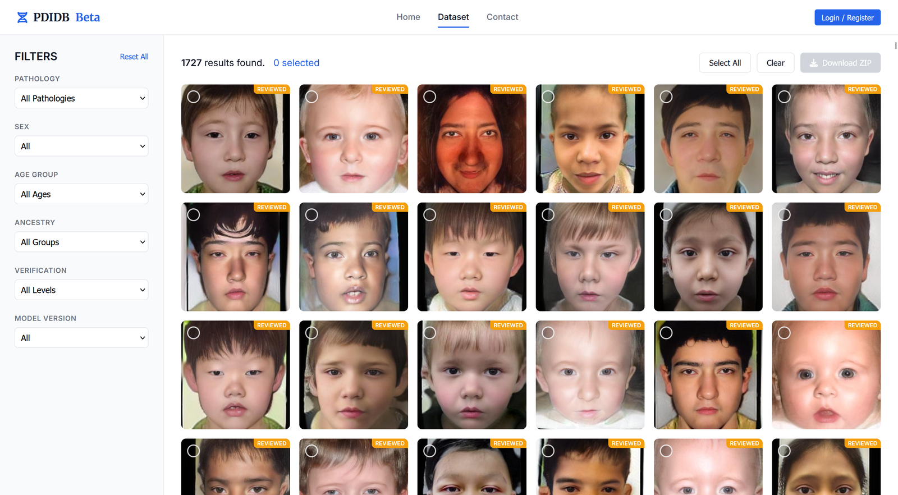
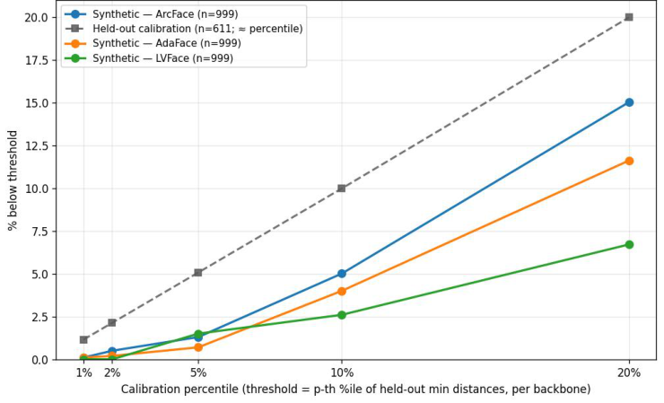
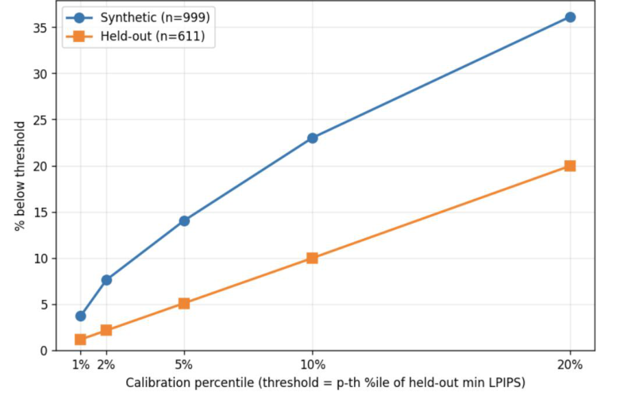

# FaceKit

A lightweight toolkit for interpretable facial phenotyping in rare genetic
diseases. FaceKit turns frontal photographs into standardized, pose-corrected
geometric measurements and z-scores against a normative reference; trains
cohort-specific StyleGAN3 generators for synthetic faces; and audits those
synthetic faces for identity and appearance leakage before they are shared.



Example faces on this page are derived from the [GestaltMatcher Database
(GMDB)](https://db.gestaltmatcher.org) and are shown with consent.

## Installation

```bash
pip install -e .[all]        # everything below
pip install -e .[morph]      # extract-landmarks, average-face
pip install -e .[geometric]  # extract-features, extract-features-custom, score, resolve-diseases
pip install -e .[synth]      # pack, train, generate  (StyleGAN3; training needs a CUDA GPU)
pip install -e .[enhance]    # enhance               (DDColor + GFPGAN)
pip install -e .[privacy]    # privacy               (InsightFace + LPIPS)
```

Python ≥ 3.10; tested on 3.13 with PyTorch 2.10. The `synth`, `enhance` and
`privacy` extras pull in PyTorch. Model weights download on first use: the
MediaPipe Face Landmarker and InsightFace `buffalo_l` to their own caches,
DDColor (about 900 MB), GFPGAN (350 MB) and facexlib (200 MB) to
`~/.cache/facekit` (override with `FACEKIT_CACHE_DIR`). The StyleGAN3 custom
CUDA kernels are compiled on first use when `nvcc` is available and fall back
to a slower reference implementation otherwise.

**License note.** FaceKit is released for non-commercial use (CC BY-NC 4.0),
and the vendored StyleGAN3 is under NVIDIA's non-commercial source code
license. See [License](#license).

## Quick start

```bash
# Phenotyping: cohort-aware, subfolders of images/ become cohorts
facekit extract-landmarks -i images/ -o outputs/ --format jsonl --transform
facekit extract-features  -i outputs/images_landmarks.jsonl -o results/
facekit score             -i results/phenotypes_all.csv -o results/
facekit average-face      -i images/ -o results/

# Synthetic faces: one generator per cohort
facekit enhance  -i raw/ -o prepared/                      # optional preprocessing
facekit pack     -i prepared/train -o datasets/            # 256x256 crops + StyleGAN3 zips
facekit train    --data datasets/noonan.zip -o runs/noonan --gpus 1 --batch 32 --batch-gpu 8
facekit generate --network runs/noonan/00000-*/network-snapshot-005000.pkl \
                 -o synthetic/ --name noonan --n 500

# Privacy audit of the generator against a patient-disjoint held-out partition
facekit privacy --train datasets/train --heldout prepared/heldout \
                --synthetic synthetic/ -o privacy/
```

Every command accepts `--help`. Inputs are either a folder of images or a
folder of cohort subfolders (`images/<cohort>/*.jpg`); outputs keep the cohort
structure, so the result of one command is the input of the next.

## Commands

| Module | Command | What it does |
| --- | --- | --- |
| Phenotyping | `extract-landmarks` | MediaPipe 478-point landmarks per image, as JSON or one JSONL per run; optional blendshapes, head-pose matrix, mesh visualization. |
| | `extract-features` | 120 pose-corrected geometric measurements per face, as a CSV. |
| | `extract-features-custom` | The same extractor driven by a user JSON mapping cohorts to feature groups; loads extra `@register_feature` formulas from a user file. |
| | `score` | Feature-level z-scores against a normative reference (the packaged FairFace reference by default). |
| | `average-face` | Landmark-aligned average face per cohort. |
| | `resolve-diseases` | Resolve disease names to MONDO IDs and cache them. |
| Synthetic faces | `enhance` | Colorize grayscale photographs (DDColor) and restore small faces (GFPGAN), each only where a test says it is needed. |
| | `pack` | Crop each face to a fixed square from its landmarks and pack a cohort into a StyleGAN3 dataset zip. |
| | `train` | Train a StyleGAN3 generator with the settings used for the FaceKit generators. |
| | `generate` | Sample faces from a generator pickle into the cohort folder layout. |
| Privacy | `privacy` | Identity (ArcFace, AdaFace, LVFace) and appearance (LPIPS) leakage audit of synthetic faces against the training images. |

## Phenotyping

### Landmarks and measurements

<p>



</p>

Left to right: the 478-point MediaPipe mesh on a face with Crouzon syndrome;
four of the 120 measurements drawn on the same face (inter-pupillary,
inter-canthal, nasal base and mouth width, each normalized by bizygomatic
width); the average face of the GMDB Williams syndrome cohort from
`average-face`. The full list of measurements, their units and sign
conventions is in [`docs/FEATURE_GLOSSARY.md`](docs/FEATURE_GLOSSARY.md); the
output schemas are in [`docs/OUTPUT_FORMAT.md`](docs/OUTPUT_FORMAT.md).

### Pose correction



Every measurement is computed on landmarks that have been rotated back to a
frontal view. A rotated face projects a landmark at
$x_{\text{img}} = X\cos\theta + Z\sin\theta$, so undoing the rotation needs
the depth $Z$ of each landmark. FaceKit takes $Z$ from a fixed **canonical
depth table** of the 478 landmarks, not from MediaPipe's per-image depth
estimate: the per-image estimate is almost entirely template and its residual
is noise, and using it lowers the intra-patient reliability of the
measurements below that of not correcting pose at all. Rescaling by
$\cos\theta$ alone (a flat-face assumption) is measurably worthless because
all measurements are ratios, in which such a factor cancels; the term that
matters is $Z\sin\theta$. The pose matrix from `extract-landmarks --transform`
is therefore all the correction needs. Rows extracted with and without a pose
matrix use two different feature definitions and must not be pooled.

### Normative z-scores

`extract-features` reports each measurement in its own units. `score`
expresses it as $z = (x - \mu) / \sigma$ against a control population. The
packaged reference (`src/facekit/data/reference_fairface.csv`) holds the
per-feature mean, SD and n of 886 FairFace control images that pass the
frontal-pose gate, sampled across three ancestry groups. Pass `--reference` a
phenotype CSV of your own controls to derive a reference from them instead;
the same pose gate is applied. A reference and the faces scored against it
must come from the same feature definition.

### Custom disease-to-feature mapping

`extract-features-custom` takes a JSON that maps cohort folder names to the
feature groups to compute (see `custom_mapping.json`) and optionally a Python
file with extra formulas:

```python
# my_features.py
from facekit.api import register_feature

@register_feature(group="MY_NEW_GROUP", csv_columns=["my_metric"],
                  hpo_terms=[("HP:0001234", "Example phenotype")])
def my_metric(lm, scales):
    return {"my_metric": float(lm[0, 0])}
```

```bash
facekit extract-features-custom -i images/ -o results/ \
    --user-mapping custom_mapping.json --user-features my_features.py
```

Plugins are checked against the base 120 columns and the HPO direction codes;
collisions raise at registration time.

## Synthetic faces

Retrospective clinical photographs are heterogeneous, so the training corpus
is standardized first, then one StyleGAN3 generator is trained per cohort.
Details of every step and every default are in
[`docs/SYNTHETIC.md`](docs/SYNTHETIC.md).

### `enhance`: colorize and restore where needed



`enhance` applies DDColor when an image is grayscale (mean HSV saturation
below `--saturation`, default 0.03) and GFPGAN when the face is small (the
landmark box's shorter side below `--min-face`, default 128 px). Both tests
can be forced or switched off. Every image is written out, processed or not,
and `enhance_log.csv` records the decision per image.

### `pack` and `train`

`pack` locates each face from its landmarks, crops a square with a 30 %
margin, resizes it to 256 × 256, writes the crops to `<out>/<cohort>/` and
packs each cohort into a StyleGAN3 dataset zip. `train` runs the vendored
StyleGAN3 with the settings the FaceKit generators were trained with:
`stylegan3-t`, R1 weight γ = 2, horizontal flips, 5,000 kimg, learning rates
2.5 × 10⁻³ (G) and 2 × 10⁻³ (D) with cosine decay, and an 8-layer mapping
network. Any native StyleGAN3 option passes through `--extra`. Training needs
a CUDA GPU; on one B200 MIG slice (45 GB) a 256 × 256 run takes about 85 s
per kimg.

### `generate` and the PDIDB

[](http://pdidb-dev.wglab.org/)

`generate` samples a generator pickle into `<out>/<cohort>/seedNNNN.png`, one
folder per generator, so the images go straight back through
`extract-features` for validation. Synthetic images from the ten GMDB
rare-disease generators built with this pipeline are browsable and
downloadable at the **[PDIDB](http://pdidb-dev.wglab.org/)**, filterable by
pathology, sex, age group and ancestry. The pre-trained generators themselves
are not distributed yet (see [Roadmap](#roadmap)).

When synthetic faces are used for augmentation, keep in mind what the
manuscript found: within a cohort the synthetic and real distributions of a
measurement agree, and the measurements that separate one cohort from the
others agree in direction for most measurement pairs, but the synthetic
cohorts are consistently **narrower** than the real ones (variance ratio
below one in every facial region).

## Privacy audit

<p>


</p>

Because a generator is trained on real patients, `privacy` asks two separate
questions before its output is shared: does a synthetic face reproduce the
**identity** of a training patient (recognition embeddings: ArcFace by
default, AdaFace and LVFace when their model files are given), and does it
reproduce the **appearance** of a training photograph (LPIPS)? Every
synthetic and every held-out real image is characterized by its distance to
the nearest training image of the same cohort. The threshold at percentile
$p$ is the $p$-th percentile of the held-out distances, so held-out images
are flagged at rate $p$ by construction and the synthetic rate is the
quantity of interest. Nearest-neighbour adversarial accuracy summarizes each
axis: a privacy loss near zero means the synthetic images lie no closer to
the training partition than held-out real images do.

The figure shows the manuscript's result for the ten GMDB generators. On the
identity axis (left) synthetic images were flagged below the held-out rate
for all three recognition models at every operating point. On the appearance
axis (right) they were flagged well above it: the generators reproduce the
acquisition characteristics of their training photographs, not the identity
of any individual. This is an empirical audit against specific models, not a
formal privacy guarantee. Outputs are `flagging.csv`, `nnaa.csv`,
`privacy_results.json` and two plots; see
[`docs/PRIVACY.md`](docs/PRIVACY.md).

## Data

- **Patient images.** The GMDB cohorts used in the manuscript are available
  to researchers through the [GestaltMatcher Database](https://db.gestaltmatcher.org)
  under its own data-use agreement. No patient image is distributed with
  FaceKit; the figures on this page are shown with consent.
- **Normative reference.** `src/facekit/data/reference_fairface.csv` is
  derived from [FairFace](https://github.com/joojs/fairface) and ships with
  the package. Rebuild it with `scripts/build_reference.py`.
- **Synthetic faces.** Browse and download at the
  [PDIDB](http://pdidb-dev.wglab.org/).
- **Held-out partitions for the privacy audit** must be disjoint from the
  training partition at the patient level; FaceKit does not check this.

## Roadmap

- **HPO prediction**: rank candidate [HPO](https://hpo.jax.org/) facial
  phenotype terms per patient from the 120 measurements.
- **Pre-trained generators**: `generate --cohort <name>` will download the
  ten GMDB generators once their redistribution is approved.

## Project layout

```
src/facekit/
├── cli.py                # typer entry point
├── api.py                # public plugin registry
├── commands/             # one CLI command per file
├── core/
│   ├── morph/            # landmarks, alignment, averaging, warping
│   ├── geometric/        # 120-column extractor, pose correction, batch drivers
│   ├── synth/            # face crop -> dataset zip, sampling from a generator
│   ├── enhance/          # grayscale / small-face tests, DDColor, GFPGAN
│   └── privacy/          # embeddings, LPIPS, flagging, NNAA
└── vendor/               # third-party code under its own licenses
    ├── stylegan3/        # NVIDIA StyleGAN3 (+ PyTorch 2.x fixes and --lr-schedule)
    ├── ddcolor/          # DDColor model (Apache-2.0)
    └── gfpgan/           # GFPGAN v1 clean architecture (Apache-2.0)
docs/                     # worked example, output formats, feature glossary, synthetic, privacy
scripts/                  # figure generation, reference building, MONDO download
tests/                    # pytest suite, including a CPU StyleGAN3 compatibility test
```

## Citation

If you use FaceKit, please cite:

> Chen H, Wang Z, Pollet F, Gürsoy G, Wang K. FaceKit: a lightweight toolkit
> for interpretable facial phenotyping in rare diseases. Manuscript in
> preparation, 2026.

## Acknowledgements

FaceKit builds on
[MediaPipe Face Landmarker](https://github.com/google-ai-edge/mediapipe) for landmarks,
[FaceMorpher](https://github.com/yaopang/FaceMorpher) for the landmark-aligned
average faces,
[StyleGAN3](https://github.com/NVlabs/stylegan3) for the generators,
[DDColor](https://github.com/piddnad/DDColor) and
[GFPGAN](https://github.com/TencentARC/GFPGAN) (with
[facexlib](https://github.com/xinntao/facexlib)) for image preparation,
[InsightFace](https://github.com/deepinsight/insightface),
[AdaFace](https://github.com/mk-minchul/AdaFace),
[LVFace](https://huggingface.co/bytedance-research/LVFace) and
[LPIPS](https://github.com/richzhang/PerceptualSimilarity) for the privacy
audit, and [oaklib](https://github.com/INCATools/ontology-access-kit) for
HPO/MONDO resolution. The normative reference is derived from
[FairFace](https://github.com/joojs/fairface); the patient cohorts come from
the [GestaltMatcher Database](https://db.gestaltmatcher.org).

## License

FaceKit's own code is released under the
[Creative Commons Attribution-NonCommercial 4.0 International License](https://creativecommons.org/licenses/by-nc/4.0/)
(see `LICENSE`): free to use, share and adapt for non-commercial purposes
with attribution. Code under `src/facekit/vendor/` keeps its upstream
license:

| Directory | Project | License |
| --- | --- | --- |
| `vendor/stylegan3/` | NVIDIA StyleGAN3 | NVIDIA Source Code License (non-commercial) |
| `vendor/ddcolor/` | DDColor | Apache-2.0 |
| `vendor/gfpgan/` | GFPGAN | Apache-2.0 |

Model weights downloaded at run time are governed by their publishers' terms.
